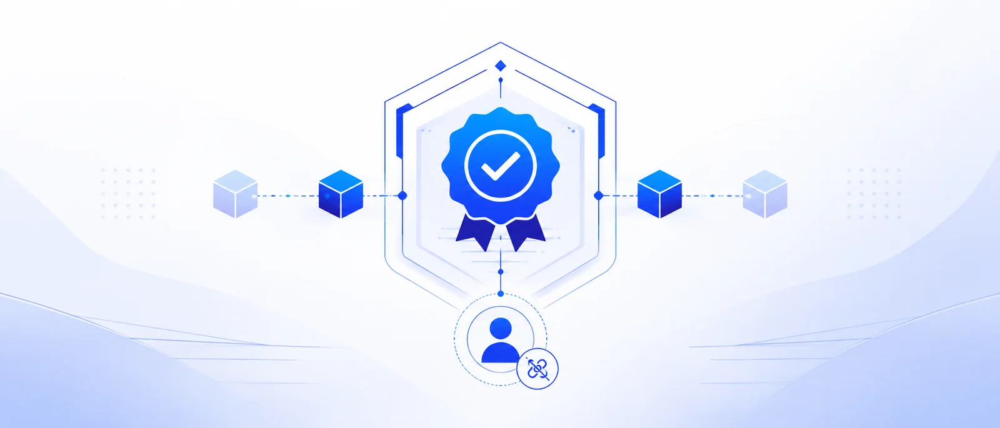
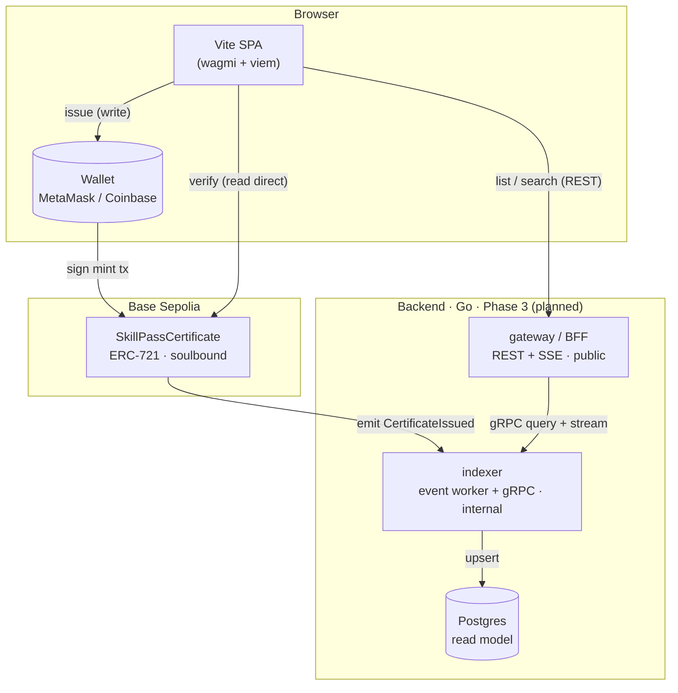

<p align="center">
  
</p>

<h1 align="center">
  
  SkillPass
</h1>

<p align="center"><strong>Open-source onchain certificate and achievement badge platform.</strong></p>

<p align="center">
  Issue <em>soulbound</em> (non-transferable) certificates to wallets, and let anyone verify them on-chain — no account required.
</p>

<p align="center">
  
  
  
  
</p>

---

## What is SkillPass?

SkillPass proves that a platform can issue a credential, anchor the proof on a public blockchain, and present it in a dashboard and a public verification page. A certificate is an **ERC-721 NFT that cannot be transferred** (soulbound) — it stays bound to the recipient, the way a diploma should. The value proposition is **trust**: anyone handed a certificate link can confirm it is real, on-chain, and belongs to who it claims — without trusting SkillPass at all.

Three audiences, one artifact:

- **Issuers** (bootcamps, communities, OSS maintainers) issue certificates to a recipient's wallet.
- **Recipients** connect a wallet to see the certificates they own.
- **Verifiers** open a public link and confirm a credential against the chain — no wallet, no login.

## Features

- 🔗 **Connect wallet** — MetaMask / injected + Coinbase Wallet, with Base Sepolia network detection and a guided switch.
- 🪪 **Issue certificate** — owner-only minting to any wallet, with an explicit privacy disclosure (on-chain data is permanent and public).
- 📜 **My certificates** — view every certificate owned by the connected wallet.
- 🔍 **Public verification** — a shareable, walletless detail page per token, with the on-chain proof (contract, token id, tx, block explorer).
- 🔒 **Soulbound** — transfers and approvals revert; the certificate cannot be sold or moved (ERC-5192 lock signalled).

## Architecture

The blockchain is the source of truth. The frontend reads and writes it directly (no backend in the MVP). A Go microservices backend (indexer + gateway over gRPC) is the **Phase 3** learning layer — it adds a fast, searchable read projection without ever holding keys.



**Why this shape:** the chain is the *write model* (source of truth); the indexer + Postgres are a *read model* (CQRS-lite). The single public certificate page always verifies against the chain, never a centralized index. Services are split by **technical concern** (a public BFF vs an internal data service), not by faux business domains.

## Tech Stack

| Layer | Tech |
|------|------|
| Smart contract | Solidity ^0.8.24, Foundry, OpenZeppelin Contracts 5.x, ERC-721 + ERC-5192 |
| Frontend | Vite, React, TypeScript (strict), Tailwind CSS v4, shadcn/ui, wagmi, viem |
| Backend *(Phase 3)* | Go, gRPC (buf), Postgres (sqlc + goose), tokio-free pure Go services |
| Chain | Base Sepolia testnet (chainId `84532`) |

## Monorepo Structure

```
skillpass/
├── apps/web/        # Vite SPA frontend
├── contracts/       # Foundry smart contract + tests + deploy
├── services/        # Go backend — gateway + indexer (Phase 3)
├── proto/           # shared gRPC contract (Phase 3)
├── docs/            # design specs, plans, assets
├── PRODUCT.md       # product/brand context (design system)
└── DESIGN.md        # visual system (tokens, type, components)
```

## Getting Started

### Smart contract (`contracts/`)

```bash
# install Foundry: https://book.getfoundry.sh
cd contracts
make install         # fetch OpenZeppelin + forge-std (deps are not vendored)
make test            # forge test — full suite
```

Deploy to Base Sepolia:

```bash
cp .env.example .env   # set a THROWAWAY testnet PRIVATE_KEY, RPC URL, Basescan key
source .env
forge script script/Deploy.s.sol:Deploy --rpc-url base_sepolia --broadcast --verify
```

> ⚠️ Use a throwaway wallet for the deployer key — never a key holding real funds. `.env` is git-ignored.

### Frontend (`apps/web/`)

```bash
cd apps/web
npm install
cp .env.example .env   # set VITE_CONTRACT_ADDRESS (from the deploy above) + RPC
npm run dev            # http://localhost:5173
```

## Roadmap & Status

| Phase | Scope | Status |
|------|-------|--------|
| **1 — Contract** | `SkillPassCertificate` soulbound ERC-721, tested, deployable | ✅ Done |
| **2 — Frontend dApp** | Connect → issue → view → verify (no backend) | 🔵 In progress |
| **3 — Backend** | Indexer + gateway, gRPC, Postgres (microservices) | ⬜ Planned |
| **4 — Increments** | Reorg handling, observability, metadata/notification service | ⬜ Later |

Beyond v0.1: IPFS metadata, issuer profiles, certificate PDF export, email invites, analytics, multi-issuer.

## License

MIT — see [`contracts/src/SkillPassCertificate.sol`](contracts/src/SkillPassCertificate.sol) SPDX header. Free to use, fork, and learn from.

---

<p align="center"><sub>Built as an open-source learning project — Web3 + microservices. Not audited; testnet only.</sub></p>
